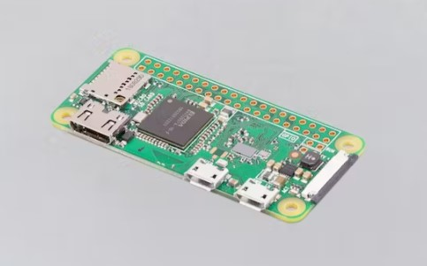

## FARMER23 
This sheet describes a script created in Visual Studio Code with the programming language Python. Hardware for this project includes 1-Wire Temp Sensors and Raspberry Pi Zero-W.

## Overview
The script was created to monitor the temperature using this hardware and creating a communication channel between 3 Raspberry Pi Zero devices and a server.
- Communication protocol is UDP
- Clients are *Rasp Pi 1, Rasp Pi 2 and Rasp Pi 3*
- Temperature data is sent from clients to a UDP server every second.
- Data from each client is stored in seperate log files
- Folder where log files are saved is Logfiles/data
- Files are saved as CSV files ( *UDP_Log1.csv , UDP_Log2.csv  , UDP_Log3.csv* )

## Dependencies.

* Functions are used from different modules to assist with managing file paths, logging data and sending notifications when temperatures exceed a specified limit.

* imported modules from previous projects. These are available to view in the folder _Source._ These include ('os_utilites', 'file_utilities', 'logfile_utilites' and mypaths.) Details of *mypaths* are available in the root of the project.

## Hardware.

* Raspberry Pi Zero-W (RPi) 

* 1-Wire Temp Sensor MAX31888

## Tests

* A test file was created *alert_test.py* to demonstrate a warning message is sent when temperature is 4C or 31C

        """python"""
        def test_temp_alert(self):
        Test1 = {'Temperature': '4C'}
        Test2 = {'Temperature': '31C'}

        Text_Alert([Test1, Test2])

        

